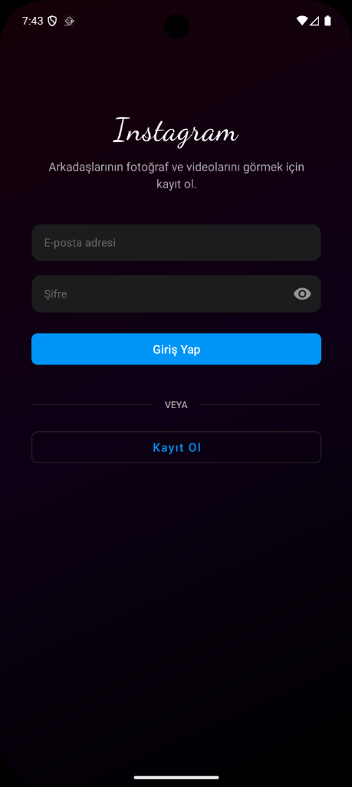
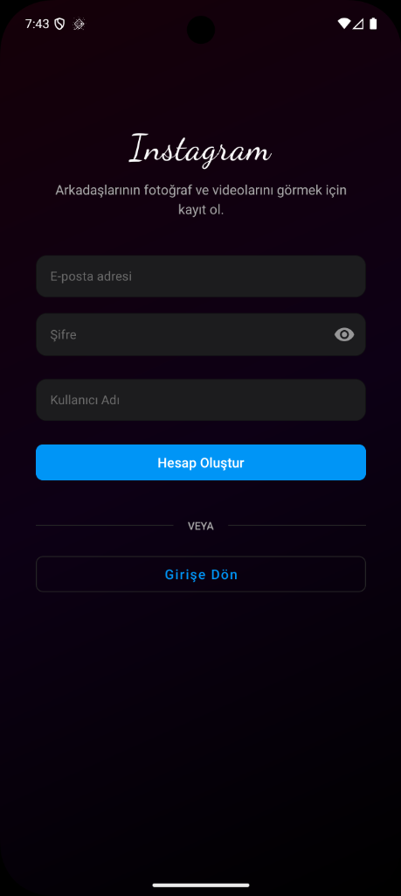
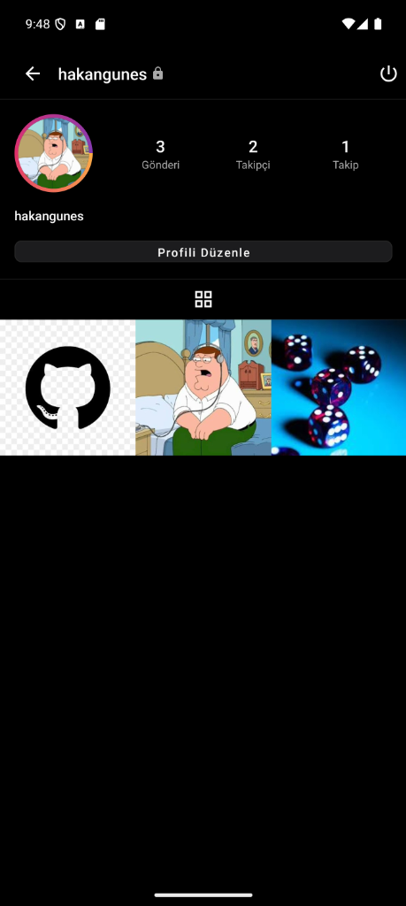
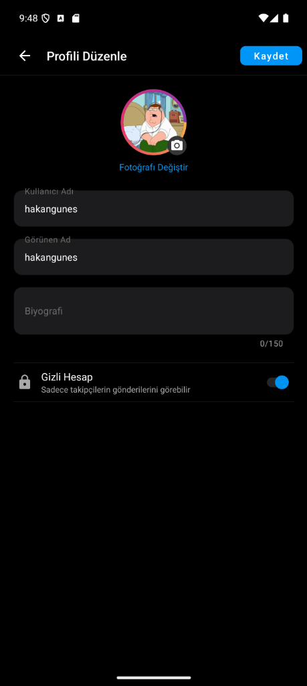
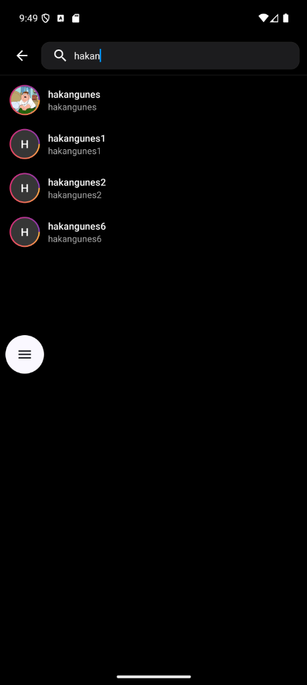
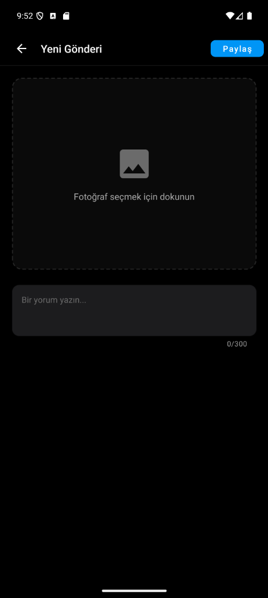
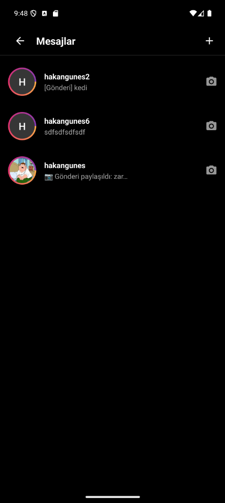
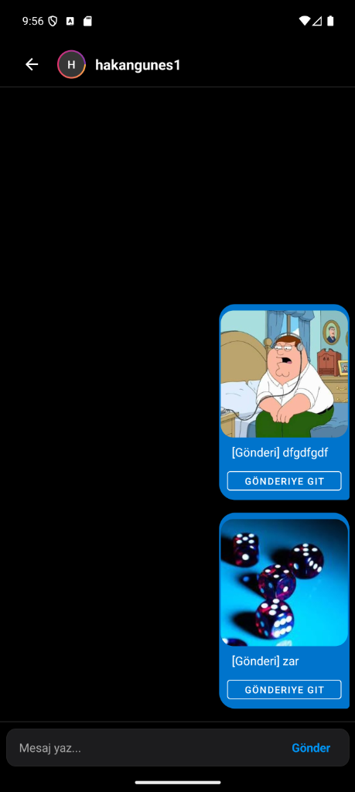
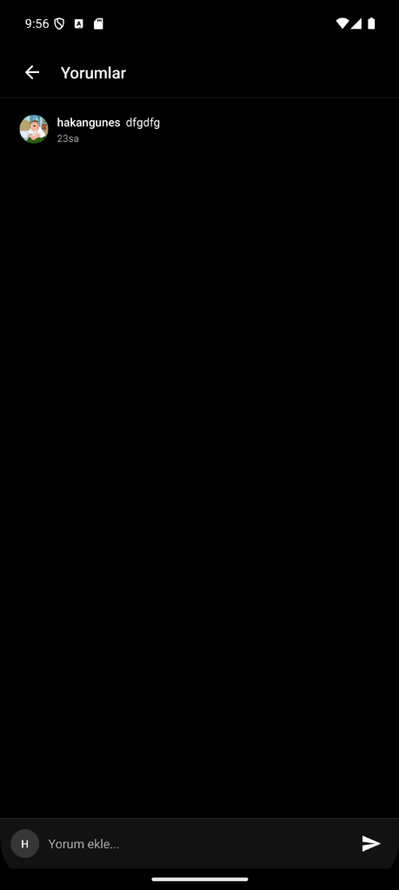

<h1 align="center">📱 Instagram Clone (Kotlin & Firebase)</h1>

<p align="center">
  
  
  
</p>

> An enterprise-grade Instagram clone designed to showcase modern Android development practices. Powered by Kotlin, Clean Architecture, and MVVM, this project delivers a seamless social media experience backed by the real-time capabilities of the Firebase ecosystem.

## 📸 Screenshots

| Login | Register | Feed | Profile |
| :---: | :---: | :---: | :---: |
|  |  |  |  |

| Edit Profile | Search | Upload Post | Chat List |
| :---: | :---: | :---: | :---: |
|  |  |  |  |

| Chat Room | Comments |
| :---: | :---: |
|  |  |

---

## 🌟 Key Features

- **Global Feed System:** Real-time synchronized global feed with high-resolution image rendering.
- **Social Ecosystem:** Robust Follow/Unfollow mechanics and dynamically updated follower counts.
- **Direct Messaging (Chat):** Instantaneous messaging workflow with post-sharing capabilities.
- **Profile Management:** Fully customizable profiles supporting Bios, avatars, and private account toggling.
- **Interactivity:** Like, comment, and share capabilities across all posts.

## 🛠 Tech Stack & Architecture

This project is meticulously built utilizing modern Android engineering standards:

* **Language:** Kotlin
* **Architecture:** Detailed implementation of **Clean Architecture** (Presentation, Domain, Data layers) utilizing the **MVVM** design pattern.
* **Concurrency:** Kotlin Coroutines & `callbackFlows` for non-blocking asynchronous streaming.
* **Image Processing:** **Glide** for intelligent caching, handled in `Dispatchers.IO` for heavy Bitmap compressions.
* **Backend Integration:** 
  * **Firebase Authentication:** Secure user sessions.
  * **Cloud Firestore:** Scalable, document-based real-time database structures.
  * **Firebase Storage:** High-capacity media uploads.

## 📁 Project Structure

The codebase is modularized strictly by layers and features, ensuring separation of concerns:

```text
com.example.instagram_clone
├── data/              # Implementations of Data Sources & Repositories
│   └── repository/    # Post, Chat, User, Follow, and Auth Repositories 
├── domain/            # Business Logic & Abstractions
│   ├── model/         # Core application entities (User, Post, Chat, Comment)
│   └── repository/    # Repository Interfaces defining the domain contracts
└── presentation/      # UI Layer (MVVM)
    ├── auth/          # Login & Signup flows
    ├── chat/          # Real-time multi-user DM system
    ├── feed/          # Global timeline
    ├── profile/       # User profile & Edit screens
    ├── search/        # User discovery mechanisms
    ├── share/         # Post routing and sharing activities
    └── upload/        # Media selection and publishing
```


## 🛡 Security & Optimizations

* **Reverse Engineering Protection:** Integrated `ProGuard/R8` obfuscation (`isMinifyEnabled = true`) on release variants.
* **Data Defense:** Hardened `AndroidManifest.xml` explicitly blocking ADB extractions (`allowBackup=false`).
* **Memory Management:** Finely-tuned `RecyclerView` cache constraints across multi-item grids drastically mitigate Out-Of-Memory (OOM) leaks on budget devices.

## 🚀 Getting Started

To run this application locally, you must connect it to your own Firebase backend:

1. Clone the repository:
   ```bash
   git clone https://github.com/your-username/insta-clone.git
   ```
2. Create a new project in the [Firebase Console](https://console.firebase.google.com/).
3. Register your Android app with the package name: `com.example.instagram_clone`.
4. Enable **Authentication** (Email/Password), **Cloud Firestore**, and **Firebase Storage**.
5. Download the `google-services.json` file and place it inside the `app/` directory of the cloned project.
6. Build and run the application via Android Studio.

## 📝 License

Distributed under the MIT License. See `LICENSE` for more information.
